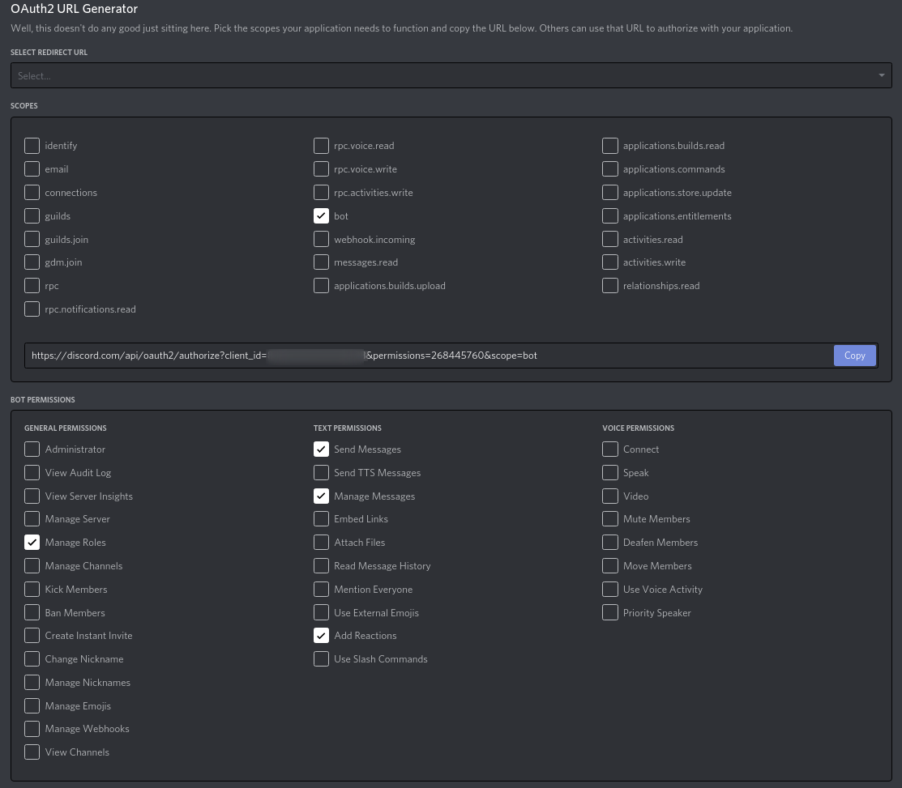

# Solitaire Discord Bot

Discord Bot for the use for Solitaire - WoW Classic Guild.

This bot was created to automate some actions on the Discord Server of the WoW Classic Guild Solitaire.

The bot is [Python](https://www.python.org/downloads/)-based and uses the [discord.py](https://discordpy.readthedocs.io/en/stable/) library. The bot itself is not public available! But you can simple clone this project and adapt it on your needs. (atm, many things like the discord roles are hard coded!)

## Prerequisites
You need Python3 to run the bot. I will recommend to use a [virtual environment](https://docs.python.org/3/tutorial/venv.html).

You also need to create a bot on [discord/developers](https://discord.com/developers/) to make it work on your own environment.

You need to save the **Token** of your Bot in an `.env` file, see [.env.EXAMPLE](.env.EXAMPLE)

Your Bot needs at least the following **Permissions**:


To *invite* your bot to your Discord-Server, use the **OAuth2 URL Generator**



## Install

```console
python3 -m venv env && source env/bin/activate
python3 -m pip install -r requirements.txt
```

## Run

```console
source env/bin/activate && env/bin/python3 bot.py
```

## TODOs
* remove statics
* add info to [README](README.md) for creating a auto-(re)starting service on a linux server
* update welcome message
  * move message into own file


## Useful links
* [discord.py API](https://discordpy.readthedocs.io/en/stable/)

