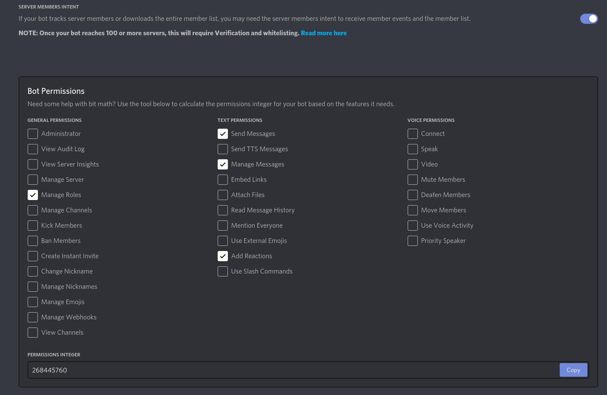

# Solitaire Discord Bot

Discord Bot for the use for Solitaire - WoW Classic Guild.

This bot was created to automate some actions on the Discord Server of the WoW Classic Guild Solitaire.

The bot is [Python](https://www.python.org/downloads/)-based and uses the [discord.py](https://discordpy.readthedocs.io/en/stable/) library. The bot itself is not public available! But you can simple clone this project and adapt it on your needs. (atm, many things like the discord roles are hard coded!)

## Prerequisites
You need Python3 to run the bot. I will recommend to use a [virtual environment](https://docs.python.org/3/tutorial/venv.html).

You also need to create a bot on [discord/developers](https://discord.com/developers/) to make it work on your own environment.

You need to save the **Token** of your Bot in an `.env` file, see [.env.EXAMPLE](.env.EXAMPLE)

Your Bot needs at least the following **Permissions**:


To *invite* your bot to your Discord-Server, use the **OAuth2 URL Generator**


### Class-Icons
You need to add the desired Class-Icons as Emoji's to your Discord server. You can find a collection of WoW Emojis for example [here](https://wowpedia.fandom.com/wiki/Wowpedia:List_of_mini_icons#World_of_Warcraft).

Then, you need to ID's of this Emoji's and update them in [statics.py](util/statics.py). You can get the ID in Discord, when you write `\:EMOJI_ALIAS:` in the chat, for example:
```
\:Warrior:
```

### Roles
You also need to add the desired roles manually to your Discord and change the mapping in [statics.py](util/statics.py), when you choose another naming then we. The same applies to the two roles 'Mitglied' and 'Gast'.

#### Move your Bot above other Roles!
After you add the Bot to your Discord, you need to move it above the roles, that it should be able to submit to other members. Otherwise the bot is not be able to change the roles!

## Install

```console
python3 -m venv env && source env/bin/activate
python3 -m pip install -r requirements.txt
```

## Run

```console
source env/bin/activate && env/bin/python3 bot.py
```

## TODOs
* remove statics
* add info to [README](README.md) for creating a auto-(re)starting service on a linux server
* update welcome message
  * move message into own file


## Useful links
* [discord.py API](https://discordpy.readthedocs.io/en/stable/)

